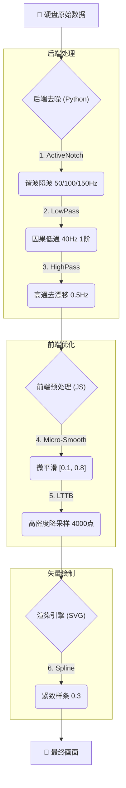

# WorkMate 数据处理中心


一个基于 epycon 的 Web UI 工具集，用于解析和转换 Abbott WorkMate 系统记录的 EP 信号数据。提供便捷的图形界面，支持数据转换、日志解析和 HDF5 预览。

## 特性

- **数据转换**：将 WorkMate 日志文件转换为 CSV 或 HDF5 格式
- **日志解析**：深度搜索和过滤 WorkMate 日志条目
- **WorkMate Version**: 4.3.2 (Recommended for x64 support) / 4.1 (Legacy x32)
- **Supported Formats**: WMx32, WMx64
- **HDF5 预览**：浏览和可视化 HDF5 文件内容
- **Web 界面**：本地 Flask 服务，支持配置管理和批量处理
- **跨平台**：优化 Windows 兼容性，处理编码和时间戳问题

## 快速开始

1. 安装依赖：`pip install -r requirements.txt`
2. 运行工具集：打开 `ui/index.html` 或运行 `python app_gui.py`
3. 使用 VS Code 任务：`Ctrl+Shift+P` > `Tasks: Run Task` > `运行 Epycon GUI`

## 核心技术：ECG 信号处理与渲染流水线 ("Golden Configuration")

本系统采用医疗级信号处理标准，确保波形渲染既具备 WorkMate 级别的平滑质感，又完整保留诊断所需的微小病理细节（如 aVL 导联切迹）。

### 📊 信号流水线图解



### 关键技术参数

1.  **后端去噪 (Signal Hygiene)**
    *   **ActiveNotch™**: 级联陷波器，同时滤除基频 (**50Hz**) 及其二次/三次谐波 (**100Hz/150Hz**)，消除非线性负载微锯齿。
    *   **Causal LowPass**: **40Hz 1阶** IIR 滤波器。优先保证**相位线性**和**无预振铃**，还原真实生理信号起始点。
    *   **HighPass**: **0.5Hz** 去基线漂移。用于消除呼吸波动带来的基线不稳。

2.  **前端微调 (Visual Polish)**
    *   **Micro-Smoothing**: 极柔和的高斯核 **`[0.1, 0.8, 0.1]`**。作为“视觉降噪器”，擦除 1 阶滤波器残留下的高频模糊（Fuzz），而不侵蚀信号波峰。

3.  **高保真渲染 (High Fidelity)**
    *   **LTTB 采样**: **4000 点/通道**。在 1080p 下提供 >2x 像素密度的“视觉无损”精度，防止高速 (100mm/s) 下的折线感。
    *   **SVG + Spline 0.3**: 弃用 WebGL，改用原生 SVG 矢量抗锯齿。配合 **0.3** 的紧致样条系数，消除数字阶梯感的同时，完美贴合原始数据点。

---

## 开发：运行测试与生成覆盖率

- 使用项目内的 PowerShell 脚本（推荐，保留在 `scripts/`）：

```powershell
.\scripts\run_tests.ps1
```

- 或使用 Python/pytest 直接运行（在虚拟环境中）：

```powershell
python -m pytest --cov=epycon --cov-report=term-missing --cov-report=html --cov-report=xml
```

生成的 HTML 报告位于 `htmlcov/index.html`，XML 报告为 `coverage.xml`，这些输出已被添加到 `.gitignore`。

## 清理仓库临时文件

在开发或 CI 运行后，可以安全地清理本地产生的临时测试产物：

- 推荐（PowerShell，仓库根目录运行）：

```powershell
.\scripts\clean_repo.ps1
```

- 手动（如果不使用脚本）：

```powershell
# 删除覆盖率报告与缓存
Remove-Item -LiteralPath htmlcov -Recurse -Force -ErrorAction SilentlyContinue
Remove-Item -LiteralPath coverage.xml -Force -ErrorAction SilentlyContinue
Remove-Item -LiteralPath .coverage -Force -ErrorAction SilentlyContinue
Remove-Item -LiteralPath .pytest_cache -Recurse -Force -ErrorAction SilentlyContinue
# 删除仓库内的 __pycache__（跳过虚拟环境）
Get-ChildItem -Recurse -Directory -Force | Where-Object { $_.Name -eq '__pycache__' -and $_.FullName -notlike '*\\venv\\*' -and $_.FullName -notlike '*\\.venv\\*' } | ForEach-Object { Remove-Item -Recurse -Force $_.FullName }
```

注意：该清理不会删除虚拟环境（`venv` / `.venv`）或源码文件。若需要删除临时脚本或已合并的临时文件（例如本地 `PR_BODY.md`），请使用 `git rm <file>` 并提交，然后推送到远端：

```powershell
git rm PR_BODY.md
git commit -m "chore: remove temporary PR body file"
git push origin <branch>
```


## 打包为可执行文件

项目支持打包为独立可执行文件，无需安装 Python：

1. 安装 PyInstaller：`pip install pyinstaller`
2. 运行打包：`pyinstaller app_gui.py --name WorkMateDataCenter --add-data "ui;ui" --add-data "config;config" --add-data "epycon;epycon"`
3. 生成的文件位于 `dist/WorkMateDataCenter/`

注意：运行时前端第三方 bundle 已集中放置于 `ui/vendor/`，请确保在打包时将该目录一并包含（例如使用 `--add-data "ui/vendor;ui/vendor"`）。

**注意**：这是目录模式打包，包含 EXE 和支持文件。您可以压缩整个文件夹分发。

运行 EXE 后，自动打开浏览器访问 `http://127.0.0.1:5000` 使用工具集。

下载与分发

- 已在 GitHub Releases 上传可分发压缩包：WorkMateDataCenter-v0.0.2-alpha.zip（包含 `WorkMateDataCenter.exe` 及必要支持文件）。
- Release 页面： https://github.com/flyskyman/epycon-webui/releases/tag/v0.0.2-alpha

快速下载安装并运行（Windows）：

1. 从上面 Release 页面下载 `WorkMateDataCenter-v0.0.2-alpha.zip`。
2. 右键解压到任意目录（例如 `C:\Tools\WorkMateDataCenter`）。
3. 双击 `WorkMateDataCenter.exe` 启动，或在 PowerShell 中运行：

```powershell
Start-Process -FilePath "C:\path\to\WorkMateDataCenter.exe"
```

4. 程序会启动本地服务并在默认浏览器打开 `http://127.0.0.1:5000`，可在界面中选择示例数据或上传自己的 `.log` 文件进行转换。

提示：若你希望在无浏览器（服务器）环境使用批处理功能，请使用源码方式运行：

```powershell
python -m epycon
```


## 项目结构（当前）

- `app_gui.py`：Flask Web 应用，项目的图形/HTTP 入口（保留为可执行主入口）。
- `epycon/`：核心 Python 包，项目实现（`__main__.py`, `core/`, `iou/`, `cli/`, `config/` 等）。
- `ui/`：前端静态资源目录（运行时界面）
  - `index.html`：工具集入口页面（现在位于 `ui/index.html`）。
  - `editor.html`：本地标注编辑器界面（`ui/editor.html`）。
  - `WorkMate_Log_Parser.html`：日志解析器界面（`ui/WorkMate_Log_Parser.html`）。
  - `h5_preview.html`：HDF5 预览页面（`ui/h5_preview.html`）。
  - `vendor/`：第三方运行时 bundle（`ui/vendor/vue.js`, `ui/vendor/tailwind.js` 等）。
- `scripts/`：构建与工具脚本
  - `WorkMateDataCenter.spec`：PyInstaller 打包配置（现在在 `scripts/`）。
  - `fix_encoding.py`：编码修复脚本（`scripts/fix_encoding.py`）。
  - `generate_fake_wmx32.py`：测试数据生成脚本。
  - `README.md`：脚本目录说明。
- `config/`：运行时配置（`config.json`, `schema.json`）。
- `docs/`：项目文档与历史发布档案（`release_notes_v0.0.3-alpha.md`, 压缩包等）。
- `examples/`：示例和示例数据（`examples/demo.py`, `examples/data/`）。
- 项目根还包含：`README.md`, `CHANGELOG.md`, `LICENSE`, `setup.py`, `requirements.txt` 等元数据与开发文件。

打包说明：为了简化 PyInstaller 配置，`--add-data "ui;ui"` 可用于包含整个前端目录（示例命令已在上方“打包为可执行文件”部分）。
